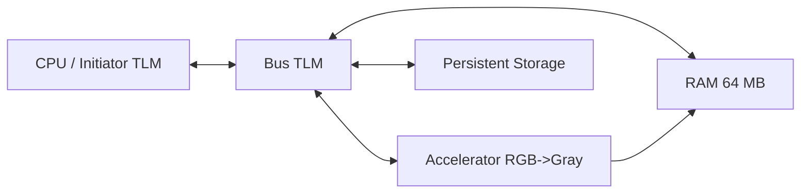
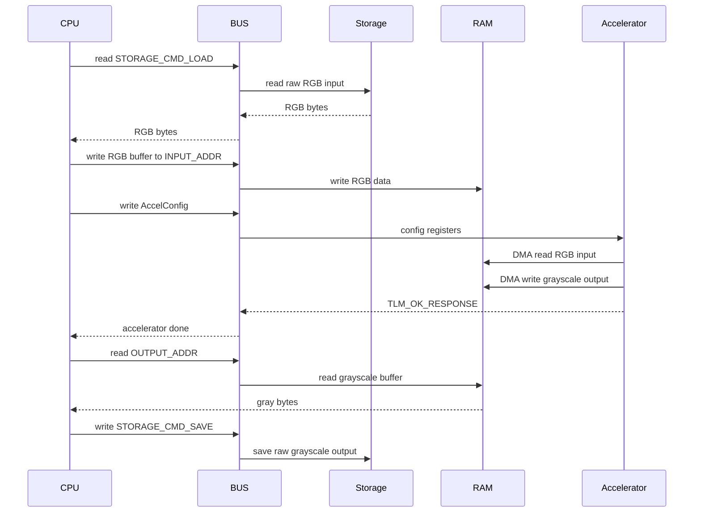

# RGB a Grayscale: Modelo SystemC/TLM e Implementación HLS

Este repositorio contiene dos implementaciones del mismo acelerador RGB a
grayscale. Se documentan como recorridos separados para que cada una pueda
compilarse y ejecutarse de forma independiente:

1. [Parte I: modelo SystemC/TLM](#parte-i-modelo-systemctlm-original): la
   implementación previa, ejecutable de forma nativa en el host.
2. [Parte II: desarrollo HLS y hardware](#parte-ii-desarrollo-hls-y-hardware):
   el IP sintetizable para KV260, su verificación HLS, integración Vivado y
   aplicación bare-metal de Vitis.

La Parte I no requiere Vitis ni Vivado. La Parte II no reemplaza al modelo
SystemC: reutiliza la misma fórmula de conversión y se valida con su propio
testbench C/C++ y co-simulación RTL.

## Estructura del repositorio

- `src/main.cpp`: punto de entrada `sc_main` del modelo SystemC
- `src/cpu.h`: módulo CPU que orquesta el flujo completo
- `src/bus.h`: router TLM por direcciones
- `src/ram.h`: memoria RAM de 64 MB con dos puertos
- `src/accelerator.h`: acelerador RGB a grayscale
- `src/persistent_storage.h`: periférico de almacenamiento persistente
- `src/memory_map.h`: mapa de memoria, tamaños y constantes
- `scripts/image_to_raw.py`: convierte JPG/PNG a raw RGB
- `scripts/raw_to_image.py`: convierte raw a PNG/JPG
- `pictures/jpg/`: imágenes de entrada de ejemplo
- `pictures/raw/`: archivos raw de ejemplo
- `hls/`: implementación HLS, testbench y script de automatización
- `vivado/`: script para crear el block design con el IP HLS
- `sw/baremetal/`: ejemplo C para controlar el IP HLS por AXI4-Lite
- `docs/`: guías de integración del IP HLS

## Requisitos compartidos

### Dependencias de sistema

En Ubuntu o Debian:

```bash
sudo apt update
sudo apt install -y build-essential cmake make wget tar
```

En Fedora:

```bash
sudo dnf install -y gcc-c++ make cmake systemc systemc-devel python3-pip
```

### Pillow

Los scripts de conversión de imágenes usan Pillow:

```bash
python3 -m pip install pillow
```

### SystemC

Si no tienes SystemC instalado, compílalo desde la fuente y luego apunta este
proyecto a esa instalación.

Ejemplo en Ubuntu/Debian:

```bash
cd /tmp
mkdir systemc-source
cd systemc-source
wget https://github.com/accellera-official/systemc/archive/refs/tags/3.0.2.tar.gz
tar -xf 3.0.2.tar.gz
cd systemc-3.0.2/
../configure --prefix=/opt/systemc
make -j"$(nproc)"
sudo make install
```

## Resumen de ejecución

| Sección | Comando principal | Resultado esperado |
|---|---|---|
| Modelo SystemC/TLM | `make native-run SYSTEMC_HOME=/usr` | `build/output.raw` |
| Visualización de salida | `python3 scripts/raw_to_image.py build/output.raw build/output.png --mode gray` | `build/output.png` |
| Flujo HLS completo | `cd hls && tclsh scripts/run_hls.tcl` | IP HLS empaquetado en `hls/export/` |
| Block design Vivado | `vivado -mode batch -source vivado/scripts/create_image_accel_bd.tcl` | proyecto en `vivado/build/image_accel_kv260/` |
| XSA con bitstream | `vivado -mode batch -source vivado/scripts/build_bitstream_xsa.tcl` | `vivado/export/image_accel_kv260_bitstream.xsa` |
| Aplicación Vitis | `xsct sw/scripts/create_vitis_app.tcl` | `sw/build/vitis_workspace/image_accel_app/Debug/image_accel_app.elf` |

La ejecución sobre una tarjeta física KV260 es opcional para este repositorio.
La implementación ya se sintetiza y empaqueta con KV260/K26 como target.

# Parte I: Modelo SystemC/TLM original

Esta parte corresponde a la implementación previa del proyecto. Modela CPU,
bus, RAM, almacenamiento persistente y acelerador con SystemC/TLM. Es el flujo
que se usa para convertir un archivo RAW RGB888 a un archivo RAW grayscale en
la máquina host.

**No requiere:** Vitis HLS, Vivado, XSCT ni una KV260.

## Compilar el modelo

El modelo nativo se compila con CMake desde el `Makefile`.

```bash
make native-build SYSTEMC_HOME=/opt/systemc
```

Si tu instalación de SystemC está en otra ruta, cambia `SYSTEMC_HOME`:

```bash
make native-build SYSTEMC_HOME=/ruta/a/systemc
```

En Fedora, con SystemC instalado desde paquetes RPM:

```bash
make native-build SYSTEMC_HOME=/usr
```

Resultado esperado:

```text
build/rgb2gray
```

## Ejecutar el modelo con la imagen de ejemplo

```bash
make native-run SYSTEMC_HOME=/opt/systemc
```

Por defecto el binario usa:

- entrada: `pictures/raw/grumpy-online.raw`
- salida: `build/output.raw`

En Fedora, si SystemC esta instalado desde paquetes RPM, usa:

```bash
make native-run SYSTEMC_HOME=/usr
```

Resultado esperado en la terminal:

```text
CPU: pipeline start
Storage: read 6220800 B
Accel: processing 2073600 pixels
Storage: wrote 2073600 B to 'build/output.raw'
CPU: pipeline done
```

Archivo esperado:

```text
build/output.raw
```

La salida RAW es grayscale de un byte por píxel:

```text
1920 * 1080 = 2,073,600 bytes
```

## Convertir la salida RAW a PNG

```bash
python3 scripts/raw_to_image.py build/output.raw build/output.png --mode gray
```

Resultado esperado:

```text
Wrote build/output.png from 2073600 bytes (1920x1080, gray)
```

Archivo esperado:

```text
build/output.png
```

## Ejecutar el modelo con cualquier imagen 1920x1080

El modelo nativo no lee JPG/PNG directamente. Primero hay que convertir la
imagen a RAW RGB888 sin encabezado.

### Caso 1: la imagen ya es 1920x1080

```bash
python3 scripts/image_to_raw.py ruta/a/imagen_1920x1080.png build/custom_input.raw
```

Resultado esperado:

```text
Wrote 6220800 bytes to build/custom_input.raw (1920x1080, RGB888)
```

### Caso 2: la imagen debe redimensionarse a 1920x1080

```bash
python3 scripts/image_to_raw.py ruta/a/imagen.png build/custom_input.raw --resize
```

Resultado esperado:

```text
Wrote 6220800 bytes to build/custom_input.raw (1920x1080, RGB888)
```

### Ejecutar el modelo con esa imagen

Usa el binario nativo directamente para elegir entrada y salida:

```bash
build/rgb2gray build/custom_input.raw build/custom_output.raw
```

Resultado esperado:

```text
Storage: read 6220800 B from 'build/custom_input.raw'
Accel: processing 2073600 pixels
Storage: wrote 2073600 B to 'build/custom_output.raw'
CPU: pipeline done
```

### Convertir la salida a PNG

```bash
python3 scripts/raw_to_image.py build/custom_output.raw build/custom_output.png --mode gray
```

Resultado esperado:

```text
Wrote build/custom_output.png from 2073600 bytes (1920x1080, gray)
```

# Parte II: Desarrollo HLS y hardware

La implementación de hardware del acelerador está en `hls/`. El objetivo es
mantener el mismo comportamiento funcional del modelo SystemC/TLM:

- entrada RAW RGB888, con tres bytes por píxel en orden `R, G, B`
- salida RAW grayscale, con un byte por píxel
- resolución esperada de `1920 x 1080`
- `2,073,600` píxeles por imagen completa
- conversión usando la aproximación entera BT.601:

```text
gray = (77 * R + 150 * G + 29 * B) >> 8
```

## Organización HLS

| Archivo | Uso |
|---|---|
| `hls/src/image_accel.hpp` | declaración del top HLS |
| `hls/src/image_accel.cpp` | implementación sintetizable del acelerador |
| `hls/src/image_accel_types.hpp` | tipos, constantes y estructuras HLS |
| `hls/tb/image_accel_tb.cpp` | testbench en C++ para C simulation y co-simulation |
| `hls/scripts/run_hls.tcl` | script Tcl para automatizar el flujo HLS |

La función top es:

```cpp
void image_accel(
    volatile const uint8_t* input_rgb,
    volatile uint8_t* output_gray,
    uint32_t num_pixels
);
```

Internamente el diseño separa el pipeline en tres etapas:

1. `read_input`: lee bytes RGB desde memoria AXI4-MM.
2. `rgb_to_gray`: convierte cada píxel RGB a grayscale.
3. `write_output`: escribe un byte grayscale por píxel en memoria AXI4-MM.

Las etapas se conectan con `hls::stream` y el top usa `#pragma HLS DATAFLOW`.
Los lazos principales usan `#pragma HLS PIPELINE`.

## Configuración HLS

Se usó la siguiente configuración:

| Parámetro | Valor |
|---|---|
| Herramienta | Vitis HLS 2024.1 |
| Target | AMD Kria KV260 / K26 SOM |
| Parte | `xck26-sfvc784-2LV-c` |
| Frecuencia | `250 MHz` |
| Periodo de reloj | `4 ns` |
| Incertidumbre | `12.5%` / `0.5 ns` |
| Flujo | Vivado IP |
| Formato de salida | IP Catalog |

Para ejecutar esta parte se necesitan Vitis HLS, Vivado y Vitis/XSCT 2024.1.
La Parte I puede ejecutarse aunque estas herramientas no estén instaladas.

## Ejecutar y verificar el flujo HLS

Desde la carpeta `hls/`:

```bash
cd hls
tclsh scripts/run_hls.tcl
```

El script ejecuta:

1. C simulation.
2. C synthesis.
3. C/RTL co-simulation con Verilog.
4. Package/export como Vivado IP.

El script intenta localizar automáticamente:

```text
/tools/Xilinx/Vitis/2024.1/bin/vitis-run
/tools/Xilinx/Vitis_HLS/2024.1/bin/vitis_hls
```

Si las herramientas no están en esas rutas, primero carga el entorno de AMD:

```bash
source /tools/Xilinx/Vitis/2024.1/settings64.sh
source /tools/Xilinx/Vitis_HLS/2024.1/settings64.sh
```

Luego vuelve a ejecutar:

```bash
tclsh scripts/run_hls.tcl
```

Resultado esperado:

```text
HLS C simulation: pass
HLS C synthesis: pass
C/RTL co-simulation: Verilog: Pass
Package/export: pass
```

## Salidas generadas por HLS

El script genera archivos temporales en:

```text
hls/build/
```

El IP exportado queda en:

```text
hls/export/xilinx_com_hls_image_accel_1_0.zip
```

Cuando se usa la interfaz gráfica de Vitis, el IP también puede quedar en:

```text
hls/image_accel/image_accel/hls/impl/ip/xilinx_com_hls_image_accel_1_0.zip
```

## Flujo Vivado y Vitis

### Crear el block design

Desde la raíz del repositorio:

```bash
vivado -mode batch -source vivado/scripts/create_image_accel_bd.tcl
```

Si `vivado` no está en el `PATH`:

```bash
/tools/Xilinx/Vivado/2024.1/bin/vivado -mode batch -source vivado/scripts/create_image_accel_bd.tcl
```

Resultado esperado:

```text
Vivado block design created successfully.
Project: vivado/build/image_accel_kv260
Block design: image_accel_system
```

### Exportar XSA sin bitstream

Este paso es suficiente para revisar la plataforma y crear una aplicación Vitis
sin programar hardware:

```bash
vivado -mode batch -source vivado/scripts/export_xsa.tcl
```

Resultado esperado:

```text
vivado/export/image_accel_kv260.xsa
```

### Generar bitstream y XSA para hardware

Este paso ejecuta synthesis, implementation, routing y bitstream:

```bash
vivado -mode batch -source vivado/scripts/build_bitstream_xsa.tcl
```

Resultado esperado:

```text
vivado/build/image_accel_kv260/image_accel_kv260.runs/impl_1/image_accel_system_wrapper.bit
vivado/export/image_accel_kv260_bitstream.xsa
```

Resultado obtenido en esta implementación:

```text
Timing met
WNS = 1.035 ns
TNS = 0.000 ns
WHS = 0.012 ns
THS = 0.000 ns
```

### Crear y compilar la aplicación Vitis

```bash
xsct sw/scripts/create_vitis_app.tcl
```

Si `xsct` no está en el `PATH`:

```bash
/tools/Xilinx/Vitis/2024.1/bin/xsct sw/scripts/create_vitis_app.tcl
```

Resultado esperado:

```text
Vitis standalone application created successfully.
Workspace: sw/build/vitis_workspace
Application: image_accel_app
Hardware XSA: vivado/export/image_accel_kv260_bitstream.xsa
```

Archivo esperado:

```text
sw/build/vitis_workspace/image_accel_app/Debug/image_accel_app.elf
```

La aplicación usa el mapa de direcciones generado por Vitis:

```c
#define XPAR_IMAGE_ACCEL_0_S_AXI_CONTROL_BASEADDR 0xA0000000
#define XPAR_IMAGE_ACCEL_0_S_AXI_CONTROL_HIGHADDR 0xA000FFFF
```

### Testbench HLS

El testbench `hls/tb/image_accel_tb.cpp` verifica:

- pixeles conocidos: negro, blanco, rojo, verde, azul y valores mixtos
- un patrón determinístico de `1024` pixeles
- comparación contra la misma fórmula entera usada por el acelerador

El resultado esperado de la simulación es:

```text
image_accel testbench passed
```

En co-simulation, el resultado esperado es:

```text
Verilog: Pass
```

### Interfaces del IP HLS

El IP empaquetado expone:

| Interfaz | Tipo | Uso |
|---|---|---|
| `s_axi_control` | AXI4-Lite slave | registros de control |
| `m_axi_gmem0` | AXI4 memory-mapped master | lectura de imagen RGB |
| `m_axi_gmem1` | AXI4 memory-mapped master | escritura de imagen grayscale |
| `ap_clk` | clock | reloj del acelerador |
| `ap_rst_n` | reset activo bajo | reinicio del acelerador |
| `interrupt` | interrupción | señal opcional de finalización |

El mapa de registros AXI4-Lite generado por HLS es:

| Offset | Registro | Uso |
|---:|---|---|
| `0x00` | `CTRL` | `AP_START`, `AP_DONE`, `AP_IDLE`, `AP_READY`, `AUTO_RESTART`, `INTERRUPT` |
| `0x04` | `GIER` | habilitación global de interrupciones |
| `0x08` | `IP_IER` | habilitación de interrupciones del IP |
| `0x0c` | `IP_ISR` | estado de interrupciones del IP |
| `0x10` | `input_rgb_1` | dirección base de entrada, bits bajos |
| `0x14` | `input_rgb_2` | dirección base de entrada, bits altos |
| `0x1c` | `output_gray_1` | dirección base de salida, bits bajos |
| `0x20` | `output_gray_2` | dirección base de salida, bits altos |
| `0x28` | `num_pixels` | cantidad de pixeles a procesar |

Para una imagen completa de 1080p:

```text
input_rgb bytes  = 1920 * 1080 * 3 = 6,220,800
output_gray bytes = 1920 * 1080     = 2,073,600
num_pixels        = 1920 * 1080     = 2,073,600
```

La salida HLS es una imagen grayscale de un byte por píxel. No se genera una
imagen RGB con los tres canales replicados.

### Integración esperada en Vivado

La guia detallada de integracion esta en:

```text
docs/vivado_hls_integration.md
```

El estado de entregables y tareas pendientes esta en:

```text
docs/project_status.md
```

Para integrar el IP en una plataforma KV260:

1. Agregar `hls/export/xilinx_com_hls_image_accel_1_0.zip` al IP Catalog.
2. Instanciar el IP `image_accel`.
3. Conectar `s_axi_control` al AXI master del PS mediante AXI Interconnect o SmartConnect.
4. Conectar `m_axi_gmem0` y `m_axi_gmem1` hacia DDR mediante SmartConnect.
5. Conectar `ap_clk` al reloj de `250 MHz` o al reloj de sistema disponible.
6. Conectar `ap_rst_n` al reset activo bajo correspondiente.
7. Opcionalmente conectar `interrupt` al controlador de interrupciones del PS.

El software embebido debe escribir las direcciones base de entrada/salida,
escribir `num_pixels` y activar `AP_START` en el registro `CTRL`.

El script para crear el block design Vivado esta en:

```text
vivado/scripts/create_image_accel_bd.tcl
```

Se ejecuta desde la raiz del repositorio:

```bash
vivado -mode batch -source vivado/scripts/create_image_accel_bd.tcl
```

El XSA para Vitis se exporta con:

```bash
vivado -mode batch -source vivado/scripts/export_xsa.tcl
```

Para generar un XSA con bitstream para ejecutar en hardware real:

```bash
vivado -mode batch -source vivado/scripts/build_bitstream_xsa.tcl
```

### Software embebido de ejemplo

Se incluye un ejemplo bare-metal de control por registros en:

```text
sw/baremetal/
```

El ejemplo contiene:

| Archivo | Uso |
|---|---|
| `sw/baremetal/image_accel_control.h` | offsets, bits y API del driver |
| `sw/baremetal/image_accel_control.c` | escrituras/lecturas MMIO AXI4-Lite |
| `sw/baremetal/main.c` | plantilla de aplicación embebida |

El programa configura:

```text
input_rgb address
output_gray address
num_pixels
AP_START
```

Luego espera `AP_DONE`. Las direcciones reales se deben reemplazar con las que
asigne Vivado/Vitis en la plataforma final.

La aplicacion standalone de Vitis se puede crear con:

```bash
xsct sw/scripts/create_vitis_app.tcl
```

Si `xsct` muestra `ERROR: xlsclients is not available on the system`, instala
la utilidad `xlsclients` en el sistema host y ejecuta de nuevo el comando desde
una terminal con el entorno de Vitis cargado.

En Fedora:

```bash
sudo dnf install -y xlsclients dbus-x11
```

# Anexo A: Arquitectura del modelo SystemC/TLM (Parte I)

Esta sección describe la arquitectura y las transacciones internas de la
implementación SystemC/TLM de la Parte I. No corresponde al IP HLS ni al block
design de Vivado.

## Organización del módulo

- `CPU`: inicia la secuencia leyendo el raw de entrada, copiándolo a RAM,
  activando el acelerador y almacenando el resultado.
- `Bus`: enruta transacciones hacia RAM, acelerador o almacenamiento según la
  dirección física.
- `RAM`: modela 64 MB de memoria compartida, accesible por CPU y DMA.
- `Accelerator`: lee RGB desde RAM por DMA, convierte cada píxel a
  grayscale y escribe el resultado de vuelta en RAM.
- `PersistentStorage`: carga el archivo raw de entrada y guarda el raw de
  salida.

## Marco Teorico

### Diagrama de bloques de la arquitectura propuesta



### Diagrama de secuencias



### Formato de las transacciones

Todas las interacciones usan `tlm::tlm_generic_payload` con `b_transport`.

| Campo | Uso |
|---|---|
| `command` | `TLM_READ_COMMAND` o `TLM_WRITE_COMMAND` |
| `address` | Dirección física o desplazamiento local, según el módulo |
| `data_ptr` | Buffer de entrada o salida |
| `data_length` | Tamaño en bytes del buffer |
| `streaming_width` | Igual a `data_length` para transferencias lineales |
| `byte_enable_ptr` | `nullptr` |
| `dmi_allowed` | `false` |
| `response_status` | `TLM_INCOMPLETE_RESPONSE` al inicio, luego `TLM_OK_RESPONSE` o error |

### Secuencia de transacciones del CPU

1. Lee `RGB_SIZE` bytes desde `STORAGE_BASE + STORAGE_CMD_LOAD`.
2. Escribe el buffer RGB en `INPUT_ADDR`.
3. Escribe `AccelConfig` en `ACCEL_BASE`.
4. Lee `GRAY_SIZE` bytes desde `OUTPUT_ADDR`.
5. Guarda el resultado en `STORAGE_BASE + STORAGE_CMD_SAVE`.

### Mapa de memoria utilizado

| Región | Base | Tamaño | Uso |
|---|---:|---:|---|
| RAM | `0x0000_0000` | `64 MB` | memoria compartida CPU/DMA |
| Acelerador | `0x1000_0000` | `256 B` | registros de configuración |
| Almacenamiento | `0x2000_0000` | `0x1000` | comandos de carga/guardado |

Constantes principales:

| Constante | Valor |
|---|---:|
| `IMG_WIDTH` | `1920` |
| `IMG_HEIGHT` | `1080` |
| `NUM_PIXELS` | `2,073,600` |
| `RGB_SIZE` | `6,220,800` bytes |
| `GRAY_SIZE` | `2,073,600` bytes |
| `INPUT_ADDR` | `0x0000_0000` |
| `OUTPUT_ADDR` | `0x0060_0000` |

### Resultados obtenidos

Con una imagen RGB de 1080p:

- la entrada debe tener exactamente `6,220,800` bytes
- la salida en escala de grises tiene `2,073,600` bytes
- el modelo conserva una latencia proporcional a:
  - lectura desde almacenamiento: `STORAGE_NS_PER_BYTE`
  - acceso a RAM: `RAM_NS_PER_BYTE`
  - procesamiento del acelerador: `ACCEL_NS_PER_PIXEL`

Además, el módulo `PersistentStorage` valida que el archivo de entrada sea
exactamente una imagen raw RGB de `1920 x 1080` píxeles antes de ejecutar la
simulación.

Ejecucion local del modelo SystemC/TLM:

```bash
make native-run SYSTEMC_HOME=/usr
python3 scripts/raw_to_image.py build/output.raw build/output.png --mode gray
```

Artefactos generados:

| Archivo | Tamano | Descripcion |
|---|---:|---|
| `pictures/raw/grumpy-online.raw` | `6,220,800` bytes | entrada RAW RGB888 1080p |
| `build/output.raw` | `2,073,600` bytes | salida RAW grayscale, un byte por pixel |
| `build/output.png` | `360 KiB` | visualizacion PNG de la salida grayscale |

Hashes SHA-256:

```text
88eb06fa2e56d084e9689237150c97793e3da095df8ca0fff9de963838538258  pictures/raw/grumpy-online.raw
8cce57ce6c3521d5877348d200a69fabfecade8f771016d2246101e386627998  build/output.raw
b2e6a52a6759ee2fcb0af09df75074fa1a25102c6960d3b10eee0f996c2388e4  build/output.png
```

## Notas de uso

- El punto de entrada nativo lee un archivo raw RGB, no una imagen JPG/PNG
  directamente.
- El binario nativo se genera como `build/rgb2gray` con la configuración actual de
  CMake.
- Si necesitas generar un raw de prueba, usa `scripts/image_to_raw.py` antes de
  ejecutar el binario.

## Objetivos de compilación

```bash
make native-build
make native-run
make image
```

## Disclaimer: Uso de Inteligencia Artificial
Este README fue co-creado con el uso de Inteligencia Artificial a partir de los requisitos de forma y fondo de los documentos del proyecto contemplando el texto y los diagramas. Toda la salida fue re validada y modificada segun fuera requerido para evitar condiciones de alucinaciones o perdida de obejtivos tipicos de los modelos generativos.
Damos fe que el contenido fue revisado por humanos y que cualquier error proviene tanto de la IA como de humanos

Prompts actualizados:
- Agrega un marco teorico que cumpla con el punto README del PDF adjunto.
- Crea un script Tcl para automatizar C simulation, C synthesis, co-simulation y empaquetado del IP.
- Documenta en el README el flujo HLS, las interfaces AXI y el mapa de registros.
- Actualice el README con la informacion sobre los modulos agregados.
