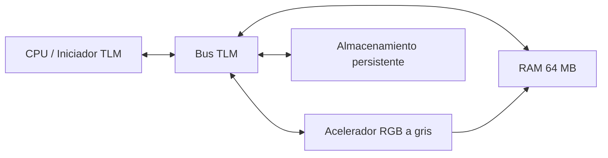
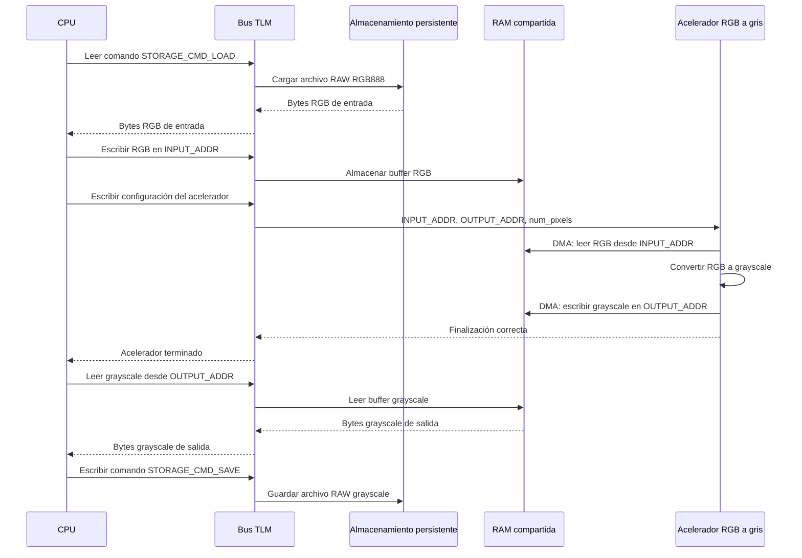

# Acelerador RGB a escala de grises en SystemC/TLM

Este es el modelo original de software/SystemC. Modela un CPU, un bus TLM, RAM
compartida, almacenamiento persistente y un acelerador RGB a escala de grises.
Se ejecuta de forma nativa en el host y no requiere Vitis, Vivado ni una
tarjeta KV260.

## Contenido

| Ruta | Propósito |
|---|---|
| `src/` | Modelo SystemC/TLM de CPU, bus, RAM, almacenamiento y acelerador |
| `pictures/` | Imágenes JPEG de ejemplo y entrada RAW RGB888 |
| `scripts/` | Utilidades de conversión de imagen a RAW y de RAW a imagen |
| `CMakeLists.txt`, `Makefile` | Flujo de compilación nativo |

## Requisitos

En Fedora:

```bash
sudo dnf install -y gcc-c++ make cmake systemc systemc-devel python3-pip
```

En Ubuntu/Debian, instala una distribución de SystemC y asigna
`SYSTEMC_HOME` a su directorio de instalación. Las utilidades de imagen
requieren Pillow:

```bash
python3 -m pip install pillow
```

## Compilar

Desde este directorio, compila indicando la ubicación de la instalación de
SystemC:

```bash
make native-build SYSTEMC_HOME=/usr
```

Para una distribución de SystemC instalada manualmente:

```bash
make native-build SYSTEMC_HOME=/opt/systemc
```

Salida esperada:

```text
build/rgb2gray
```

## Ejecutar la imagen de ejemplo

```bash
make native-run SYSTEMC_HOME=/usr
```

La ejecución predeterminada lee `pictures/raw/grumpy-online.raw` y escribe
`build/output.raw`.

La salida esperada en terminal incluye:

```text
CPU: pipeline start
Storage: read 6220800 B
Accel: processing 2073600 pixels
Storage: wrote 2073600 B to 'build/output.raw'
CPU: pipeline done
```

Convierte la salida de escala de grises, de un byte por píxel, a PNG:

```bash
python3 scripts/raw_to_image.py build/output.raw build/output.png --mode gray
```

## Ejecutar una imagen personalizada

Primero se debe convertir la imagen a RAW RGB888 sin encabezado y con
resolución 1920x1080.

Para una imagen que ya tiene resolución 1920x1080:

```bash
python3 scripts/image_to_raw.py ruta/a/imagen.png build/input.raw
```

Para redimensionar otra imagen a 1920x1080:

```bash
python3 scripts/image_to_raw.py ruta/a/imagen.png build/input.raw --resize
```

Ejecuta el modelo y visualiza el resultado:

```bash
build/rgb2gray build/input.raw build/output.raw
python3 scripts/raw_to_image.py build/output.raw build/output.png --mode gray
```

La entrada tiene `1920 * 1080 * 3 = 6,220,800` bytes. La salida tiene
`1920 * 1080 = 2,073,600` bytes.

## Comportamiento del acelerador

El modelo lee bytes RGB en orden `R, G, B` y produce un byte de escala de grises
por píxel con la siguiente aproximación entera:

```text
gray = (77 * R + 150 * G + 29 * B) >> 8
```

El modelo SystemC/TLM usa `tlm::tlm_generic_payload` y `b_transport` para las
interacciones entre CPU, bus, RAM, acelerador y almacenamiento.

## Arquitectura



## Diagrama de secuencia

El CPU carga la imagen RAW RGB desde el almacenamiento, la coloca en RAM y
configura el acelerador con las direcciones de entrada/salida y el número de
píxeles. El acelerador realiza las transferencias DMA sobre RAM y el CPU guarda
la salida grayscale en disco.



## Formato de transacciones TLM

La comunicación entre los módulos SystemC usa `tlm::tlm_generic_payload` y la
interfaz de transporte bloqueante `b_transport`. El CPU inicia las
transacciones; el bus las enruta hacia RAM, el acelerador o el almacenamiento.
El acelerador también inicia transacciones DMA hacia el segundo puerto de RAM.

| Campo de `tlm_generic_payload` | Uso en el modelo |
|---|---|
| `command` | `TLM_READ_COMMAND` para lecturas y `TLM_WRITE_COMMAND` para escrituras. |
| `address` | Dirección física en el mapa de memoria o desplazamiento local del periférico. |
| `data_ptr` | Puntero al buffer de datos de entrada o salida. |
| `data_length` | Cantidad de bytes de la transferencia. |
| `streaming_width` | Igual a `data_length` para transferencias lineales. |
| `byte_enable_ptr` | `nullptr`; no se usan habilitadores de byte individuales. |
| `dmi_allowed` | `false`; el modelo no utiliza acceso directo a memoria (DMI). |
| `response_status` | Inicia como `TLM_INCOMPLETE_RESPONSE`; termina como `TLM_OK_RESPONSE` o un estado de error. |
| `delay` | Tiempo SystemC acumulado por los módulos para modelar latencia. |

Los destinos pueden responder `TLM_ADDRESS_ERROR_RESPONSE` para una dirección
inválida, `TLM_COMMAND_ERROR_RESPONSE` para un comando no admitido o
`TLM_GENERIC_ERROR_RESPONSE` ante un error de almacenamiento. El CPU y el DMA
del acelerador verifican que la respuesta final sea `TLM_OK_RESPONSE`.

## Mapa de memoria del componente

El bus TLM enruta cada transacción según su dirección física. La RAM tiene dos
puertos: uno para el CPU y otro para el DMA del acelerador.

| Región | Rango físico | Tamaño | Uso |
|---|---:|---:|---|
| RAM compartida | `0x0000_0000` - `0x03FF_FFFF` | 64 MiB | Memoria accesible por CPU y DMA. |
| Buffer RGB de entrada | `0x0000_0000` - `0x005E_EBFF` | 6,220,800 B | Imagen RAW RGB888 de 1920x1080. |
| Buffer grayscale de salida | `0x0060_0000` - `0x007F_A3FF` | 2,073,600 B | Imagen RAW en escala de grises, un byte por píxel. |
| Registros del acelerador | `0x1000_0000` - `0x1000_00FF` | 256 B | Configuración del acelerador. |
| Almacenamiento persistente | `0x2000_0000` - `0x2000_0FFF` | 4 KiB | Comandos para cargar y guardar archivos RAW. |

El CPU inicia el acelerador mediante una escritura de la estructura
`AccelConfig` a partir de `0x1000_0000`:

| Offset | Campo | Tamaño | Descripción |
|---:|---|---:|---|
| `0x00` | `input_addr` | 64 bits | Dirección base del buffer RGB en RAM. |
| `0x08` | `output_addr` | 64 bits | Dirección base del buffer grayscale en RAM. |
| `0x10` | `num_pixels` | 32 bits | Cantidad de píxeles que debe procesar el acelerador. |
| `0x14` - `0x17` | Relleno | 32 bits | Relleno de alineamiento de la estructura C++. |

Los comandos del almacenamiento persistente son offsets relativos a
`0x2000_0000`:

| Dirección | Comando | Operación |
|---:|---|---|
| `0x2000_0000` | `STORAGE_CMD_LOAD` | Carga el archivo RAW RGB888 de entrada. |
| `0x2000_0010` | `STORAGE_CMD_SAVE` | Guarda el archivo RAW grayscale de salida. |

## Resultados obtenidos

La ejecución nativa del modelo SystemC/TLM completó el flujo de carga,
transferencia a RAM, procesamiento y guardado de la imagen.

| Evidencia | Resultado |
|---|---|
| Imagen de entrada | RAW RGB888 de 1920x1080, `6,220,800` bytes. |
| Imagen de salida | RAW grayscale de 1920x1080, `2,073,600` bytes. |
| Ejecución del modelo | El CPU configura el acelerador y este procesa `2,073,600` píxeles. |
| Archivo RAW de salida | `build/output.raw`. |
| Visualización PNG | `build/output.png`, generada a partir del RAW grayscale. |

Para incluir evidencia visual en el repositorio, agrega las siguientes imágenes
en la carpeta `images/` de este proyecto:

```text
base-accelerator/images/entrada_rgb.png
base-accelerator/images/salida_grayscale.png
```

| Entrada RGB | Salida grayscale |
|---|---|
|  |  |

La salida en formato RAW es la evidencia funcional requerida. La imagen PNG es
una visualización para revisión rápida en GitHub. Después de generar la salida,
puedes conservar ambas evidencias con:

```bash
mkdir -p images
cp build/output.raw images/salida_grayscale.raw
cp build/output.png images/salida_grayscale.png
```
