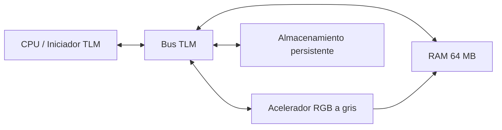

# Acelerador RGB a escala de grises en SystemC/TLM

Este es el modelo original de software/SystemC. Modela un CPU, un bus TLM, RAM
compartida, almacenamiento persistente y un acelerador RGB a escala de grises.
Se ejecuta de forma nativa en el host y no requiere Vitis, Vivado ni una
tarjeta KV260.

## Contenido

| Ruta | Propósito |
|---|---|
| `src/` | Modelo SystemC/TLM de CPU, bus, RAM, almacenamiento y acelerador |
| `pictures/` | Imágenes JPEG de ejemplo y entrada RAW RGB888 |
| `scripts/` | Utilidades de conversión de imagen a RAW y de RAW a imagen |
| `CMakeLists.txt`, `Makefile` | Flujo de compilación nativo |

## Requisitos

En Fedora:

```bash
sudo dnf install -y gcc-c++ make cmake systemc systemc-devel python3-pip
```

En Ubuntu/Debian, instala una distribución de SystemC y asigna
`SYSTEMC_HOME` a su directorio de instalación. Las utilidades de imagen
requieren Pillow:

```bash
python3 -m pip install pillow
```

## Compilar

Desde este directorio, compila indicando la ubicación de la instalación de
SystemC:

```bash
make native-build SYSTEMC_HOME=/usr
```

Para una distribución de SystemC instalada manualmente:

```bash
make native-build SYSTEMC_HOME=/opt/systemc
```

Salida esperada:

```text
build/rgb2gray
```

## Ejecutar la imagen de ejemplo

```bash
make native-run SYSTEMC_HOME=/usr
```

La ejecución predeterminada lee `pictures/raw/grumpy-online.raw` y escribe
`build/output.raw`.

La salida esperada en terminal incluye:

```text
CPU: pipeline start
Storage: read 6220800 B
Accel: processing 2073600 pixels
Storage: wrote 2073600 B to 'build/output.raw'
CPU: pipeline done
```

Convierte la salida de escala de grises, de un byte por píxel, a PNG:

```bash
python3 scripts/raw_to_image.py build/output.raw build/output.png --mode gray
```

## Ejecutar una imagen personalizada

Primero se debe convertir la imagen a RAW RGB888 sin encabezado y con
resolución 1920x1080.

Para una imagen que ya tiene resolución 1920x1080:

```bash
python3 scripts/image_to_raw.py ruta/a/imagen.png build/input.raw
```

Para redimensionar otra imagen a 1920x1080:

```bash
python3 scripts/image_to_raw.py ruta/a/imagen.png build/input.raw --resize
```

Ejecuta el modelo y visualiza el resultado:

```bash
build/rgb2gray build/input.raw build/output.raw
python3 scripts/raw_to_image.py build/output.raw build/output.png --mode gray
```

La entrada tiene `1920 * 1080 * 3 = 6,220,800` bytes. La salida tiene
`1920 * 1080 = 2,073,600` bytes.

## Comportamiento del acelerador

El modelo lee bytes RGB en orden `R, G, B` y produce un byte de escala de grises
por píxel con la siguiente aproximación entera:

```text
gray = (77 * R + 150 * G + 29 * B) >> 8
```

El modelo SystemC/TLM usa `tlm::tlm_generic_payload` y `b_transport` para las
interacciones entre CPU, bus, RAM, acelerador y almacenamiento.

## Arquitectura


