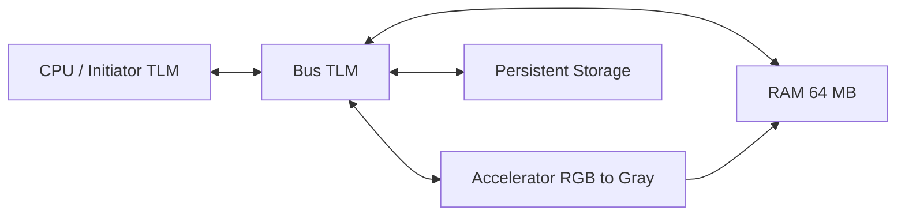

# SystemC/TLM RGB-to-Grayscale Accelerator

This is the original software/SystemC model. It models a CPU, TLM bus, shared
RAM, persistent storage, and an RGB-to-grayscale accelerator. It runs natively
on the host and does not require Vitis, Vivado, or a KV260 board.

## Contents

| Path | Purpose |
|---|---|
| `src/` | SystemC/TLM CPU, bus, RAM, storage, and accelerator model |
| `pictures/` | Example JPEG images and RAW RGB888 input |
| `scripts/` | Image-to-RAW and RAW-to-image conversion utilities |
| `CMakeLists.txt`, `Makefile` | Native build flow |

## Requirements

On Fedora:

```bash
sudo dnf install -y gcc-c++ make cmake systemc systemc-devel python3-pip
```

On Ubuntu/Debian, install a SystemC distribution and set `SYSTEMC_HOME` to its
installation directory. The image helpers require Pillow:

```bash
python3 -m pip install pillow
```

## Build

From this directory, build with the location of your SystemC installation:

```bash
make native-build SYSTEMC_HOME=/usr
```

For a manually installed SystemC distribution:

```bash
make native-build SYSTEMC_HOME=/opt/systemc
```

Expected output:

```text
build/rgb2gray
```

## Run the example image

```bash
make native-run SYSTEMC_HOME=/usr
```

The default execution reads `pictures/raw/grumpy-online.raw` and writes
`build/output.raw`.

Expected terminal output includes:

```text
CPU: pipeline start
Storage: read 6220800 B
Accel: processing 2073600 pixels
Storage: wrote 2073600 B to 'build/output.raw'
CPU: pipeline done
```

Convert the one-byte-per-pixel grayscale output to PNG:

```bash
python3 scripts/raw_to_image.py build/output.raw build/output.png --mode gray
```

## Run a custom image

Input images must be converted to headerless 1920x1080 RAW RGB888 first.

For an image already at 1920x1080:

```bash
python3 scripts/image_to_raw.py path/to/image.png build/input.raw
```

To resize another image to 1920x1080:

```bash
python3 scripts/image_to_raw.py path/to/image.png build/input.raw --resize
```

Run the model and view the result:

```bash
build/rgb2gray build/input.raw build/output.raw
python3 scripts/raw_to_image.py build/output.raw build/output.png --mode gray
```

The input is `1920 * 1080 * 3 = 6,220,800` bytes. The output is
`1920 * 1080 = 2,073,600` bytes.

## Accelerator behavior

The model reads RGB bytes in `R, G, B` order and produces one grayscale byte
per pixel using this integer approximation:

```text
gray = (77 * R + 150 * G + 29 * B) >> 8
```

The SystemC/TLM model uses `tlm::tlm_generic_payload` and `b_transport` for
the interactions between CPU, bus, RAM, accelerator, and storage.

## Architecture



