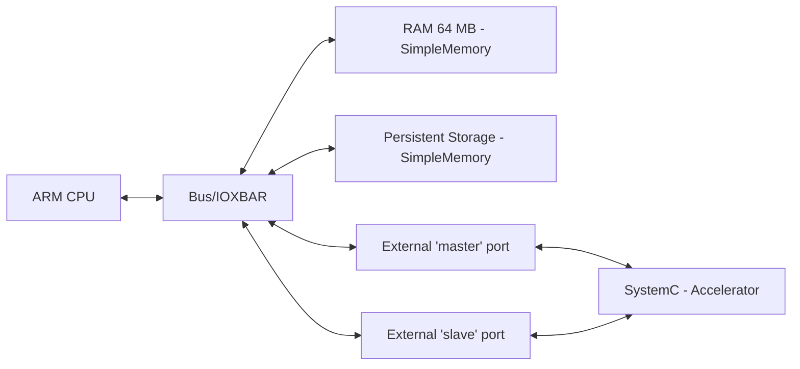
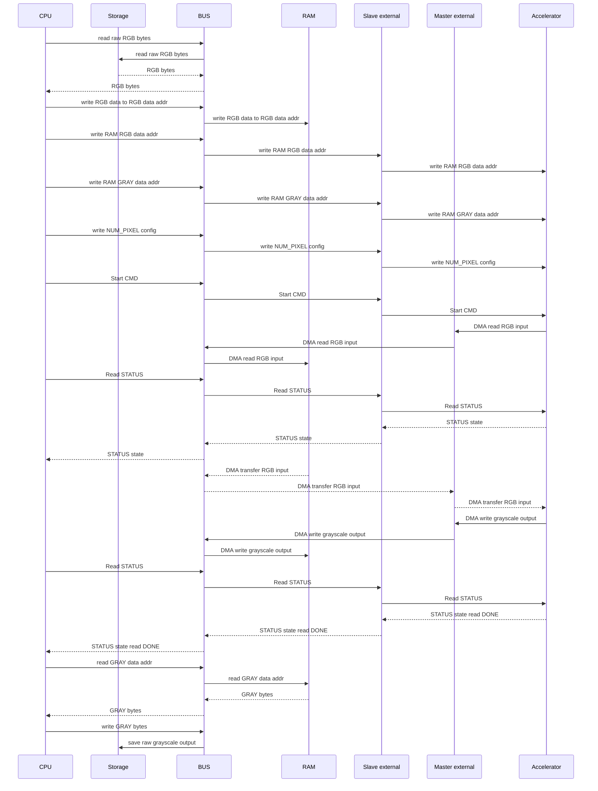

# Accelerator Gem5 Co-simulation

## Project layout

| Path | Purpose |
|---|---|
| `conf` | Gem5 system configuration generating script |
| `c_program` | Bare metal C program files |
| `gem5_tlm_src` | Script for copying gem5-SystemC bridge sources |
| `src` | SystemC module sources |

## Requirements

### Dependencies

For Ubuntu or Debian:

```bash
sudo apt update
sudo apt install scons build-essential git m4 zlib1g zlib1g-dev \
    libprotobuf-dev protobuf-compiler libprotoc-dev \
    libgoogle-perftools-dev python3-dev
```

Cross-compiling the C program requires aarch64 toolchain:
```bash
sudo apt install gcc-aarch64-linux-gnu binutils-aarch64-linux-gnu
```

### Pillow

Image conversion scripts use Pillow:

```bash
python3 -m pip install pillow
```

### GEM5

Clone the repo (this was run on the v25.1.0.1)
```bash
git clone -b v25.1.0.1 https://github.com/gem5/gem5.git
```

Gem5 must be built for ARM before building simulation. Also build 
gem5 as a library with cxx-config support and (optionally) without python:
```bash
SIM_DIR=$PWD
GEM5_DIR=/path/to/gem5/repo/
cd $GEM5_DIR
scons build/ARM/gem5.opt -j$(nproc)
scons setconfig build/ARM USE_SYSTEMC=n
scons --with-cxx-config --without-python --without-tcmalloc \
      --duplicate-sources build/ARM/libgem5_opt.so -j$(nproc)
cd $SIM_DIR
```

## Block diagram
The block diagram shows the connections between the modules in the simulation.
The two ports between SystemC and Gem5 are needed due to how the external ports behave.

The slave port only allows the CPU to send initiation transactions and the accelerator is 
able to send response transactions back. 

The master port is used so the accelerator is able to initiate transactions for the loading of
bytes and writing the bytes back into RAM.


## Sequence Diagram



### Transactions

SystemC transactions were all done with `tlm::tlm_generic_payload` using `b_transport`.

| Field | Usage |
|---|---|
| `command` | `TLM_READ_COMMAND` or `TLM_WRITE_COMMAND` |
| `address` | Physical address |
| `data_ptr` | input/output buffer |
| `data_length` | Buffers size in bytes |
| `streaming_width` | Same as `data_length` for linear transfers |
| `byte_enable_ptr` | `nullptr` |
| `dmi_allowed` | `false` |
| `response_status` | Starts with `TLM_INCOMPLETE_RESPONSE`, then `TLM_OK_RESPONSE` or error |

The CPUs memory transactions are done as volatile  memory operations which transfer bytes
between modules.

The external ports perform conversions from gem5 ```Packets``` to tlm ```tlm_generic_payload`` and viceversa.

| Field | Usage |
|---|---|
| `command` | `MemCmd::ReadReq` or `MemCmd::WriteReq` |
| `address` | Physical address |
| `size` | Buffers size in bytes |
| `flags` | 0 (empty) |
| `requestorID` | Owner  of the request |
| `data` | input/output buffer |


## Building and Running Simulation

### Automated building script

This script is intended to ease the building process. The script also allows to run
specific steps in case changes are desired in the different sources.

Sample use to run complete build:
```bash
./run_gem5_accelerator.sh \
  --input-image input.jpeg \
  --output-image output.png \
  --gem5-dir /path/to/gem5/repo
```

**NOTE: the default size for the image is 64x64 to confirm functionality. 1080p resolution is supported but conversion is slow**

Full options are as follows:

| Option | Use |
| :--- | :--- |
|  -i, --input-image | Input JPEG image file, will be resized to (64x64) if no width or height is set |
|  -g, --gem5-dir PATH | gem5 source directory |
|  -h, --help | Print this help text |
|  -e, --elf | ELF file output/input name + path |
|  -j, --jobs COUNT | Parallel build jobs (default: available CPUs) |
|  -o, --output-image PATH | Output grayscale image path (for example output.raw) |
|  -w, --width PIXELS | Image width (default: 64) |
|  -H, --height PIXELS | Image height (default: 64) |
| | |
| --build-simulator | Build the SystemC/gem5 accelerator executable |
| --build-m5        | Build the ARM64 libm5.a library |
| --build-elf       | Cross-compile the bare-metal C program |
| --prepare-input   | Resize/convert the input image to raw RGB |
| --configure       | Generate m5out/config.ini |
| --run             | Run the SystemC/gem5 simulation |
| --prepare-output  | Convert output.raw to the requested image |
| --all             | Run every step above in pipeline order |

Build the  SystemC Gem5 files:
```bash
scons gem5_root=$GEM5_DIR
```

Build the needed m5 library for C cross-compile: 
```bash
scons \
  -C $GEM5_DIR/util/m5 \
  arm64.CROSS_COMPILE=aarch64-linux-gnu- \
  build/arm64/out/libm5.a
```

Build the ARM64 bare metal C program for simulation
```bash
aarch64-linux-gnu-gcc \
  -march=armv8-a \
  -O2 -ffreestanding \
  -fno-builtin -nostdlib \
  -static -DIMAGE_WIDTH=64 -DIMAGE_HEIGHT=64 \
  -T c_program/linker.ld \
  -I$GEM5_DIR/include \
  c_program/start.S \
  c_program/convert_to_gray.c \
  $GEM5_DIR/util/m5/build/arm64/out/libm5.a \
  -o c_program/rgb2gray-arm.elf
```

Update the gem5 modules config:
```bash
$GEM5_DIR/build/ARM/gem5.opt --outdir=m5out conf/tlm_gem5_cpu_master.py  \
      --binary=c_program/rgb2gray-arm.elf \
      --image=../base-accelerator/pictures/raw/grumpy-online.raw
```

Run simulation:
```bash
build/accelerator/gem5.sc m5out/config.ini -v
```

## Memory layout
| Base | Size | Purpose |
|---|---|---|
| 0x00000000 | 64MiB | RAM |
| 0x10000000 | 256MiB | Accelerator Config port |
| 0x20000000 | 1000MiB | Persistent Memory 'NVMe' |

## Accelerator register map
| Address | Purpose |
|---|---|
| 0x00 | RAM RGB byte data location address |
| 0x08 | RAM GRAY byte data location address |
| 0x10 | Pixel amount to read config |
| 0x14 | Accelerator command config |
| 0x18 | Accelerator status |

###  Accelerator Status Flags
| Flag | Purpose |
|---|---|
| 0 | STATUS_IDLE |
| 1 | STATUS_BUSY |
| 2 | STATUS_DONE |
| 3 | STATUS_ERROR |

## Results

To test the functionality, a first run with a 64x64 image is done. This
is loaded the conversion.

With the use of debug prints the following times were seen:
- Convert to GRAY start: 2.512104 ms
- Convert ended: 2.512104 ms
- Simulation end: 3.355180 ms

After the functionality was confirmed, the 1080p image was tested:
- Convert to GRAY start: 1271.376768 ms
- Convert ended: 1271.376768 ms
- Simulation ended: 1697.761676 ms

**NOTE: Times are calculated with the gem5 ticks**

From this, it can be seen that the byte amount still has an effect over the duration of the program execution. 

It is also noticeable that most of the run time is attributed to the different memory transfers between modules.

## Disclaimer: Use of Artificial Intelligence

The use of AI was used to help clarify Gem5 python configuration. It was used as a base to properly 
connect the different modules and the external SystemC ports.

Prompt: Explain the slave_port config and how transactions are sent to the external port

It was also used to better understand how to load the bare metal code into the Gem5 cpu module.

Prompt: How can a C program for the gem5 ARM cpu be loaded

Finally it was used to advise on how to better model the accelerator to properly link with the 
Gem5 transactors.

Prompt: How can the accelerator.hh manage the transaction size difference
