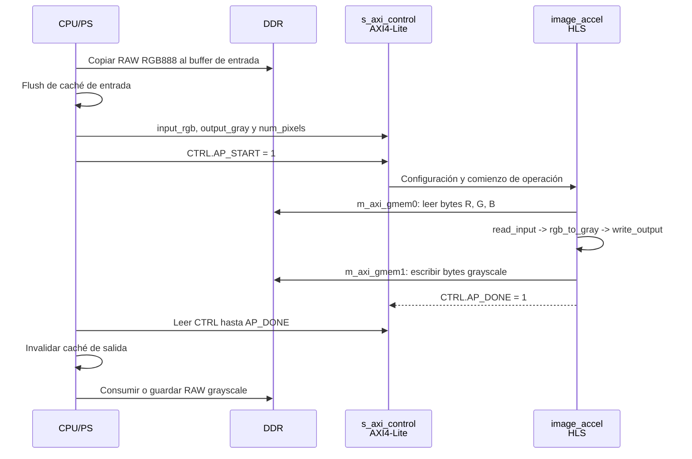
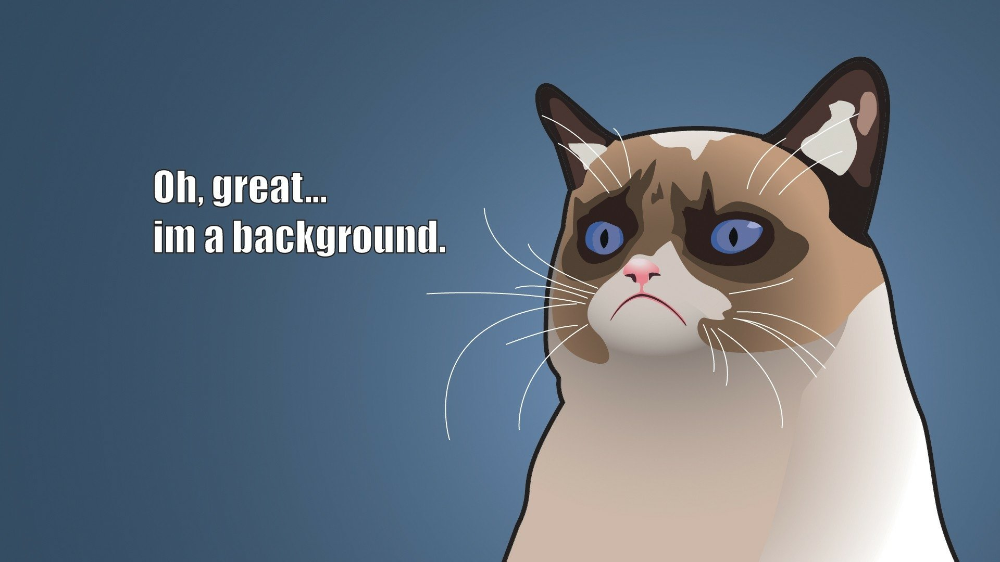

# Acelerador RGB a escala de grises en HLS

Este proyecto contiene la implementación de hardware de `image_accel`, su
testbench HLS, scripts de integración Vivado y un ejemplo de control
bare-metal en Vitis. Es independiente del modelo SystemC/TLM del proyecto
hermano.

## Resumen del diseño

| Elemento | Valor |
|---|---|
| Función top | `image_accel` |
| Target | AMD Kria KV260 / K26 SOM, `xck26-sfvc784-2LV-c` |
| Frecuencia objetivo | 250 MHz, período de 4 ns |
| Entrada | RAW RGB888, `R, G, B`, tres bytes por píxel |
| Salida | RAW en escala de grises, un byte por píxel |
| Imagen completa | 1920x1080, 2,073,600 píxeles |
| Fórmula | `(77 * R + 150 * G + 29 * B) >> 8` |

El diseño HLS se divide en tres etapas de flujo de datos:

1. `read_input`: lecturas RGB mediante AXI4 memory-mapped.
2. `rgb_to_gray`: conversión a escala de grises segmentada.
3. `write_output`: escrituras grayscale mediante AXI4 memory-mapped.

`hls::stream`, la directiva `DATAFLOW` y las directivas `PIPELINE` de los
lazos conectan y segmentan estas etapas.

## Diagrama de secuencia

El procesador carga una imagen RAW RGB888 en DDR, programa los registros
AXI4-Lite del IP y activa `AP_START`. El IP lee RGB por `m_axi_gmem0`, ejecuta
las tres etapas HLS en flujo de datos y escribe un byte grayscale por píxel por
`m_axi_gmem1`. Finalmente el software espera `AP_DONE` e invalida la caché del
buffer de salida antes de consumirlo.



## Formato de transacciones AXI

Esta implementación no usa TLM. El control se realiza mediante transacciones
AXI4-Lite de 32 bits y los datos de imagen mediante los dos puertos AXI4
memory-mapped generados por Vitis HLS. Las direcciones de los buffers son de
64 bits y se escriben como dos registros AXI4-Lite de 32 bits.

| Canal | Tipo de transacción | Datos | Uso |
|---|---|---|---|
| `s_axi_control` | Escritura AXI4-Lite | `input_rgb[31:0]`, `input_rgb[63:32]` | Dirección física del buffer RGB en DDR. |
| `s_axi_control` | Escritura AXI4-Lite | `output_gray[31:0]`, `output_gray[63:32]` | Dirección física del buffer grayscale en DDR. |
| `s_axi_control` | Escritura AXI4-Lite | `num_pixels` | Cantidad de píxeles a procesar. |
| `s_axi_control` | Escritura/lectura AXI4-Lite | `CTRL` | Inicio, estado, auto-reinicio e interrupción. |
| `m_axi_gmem0` | Lectura AXI4-MM | `input_rgb + 3*i` | Tres bytes `R,G,B` del píxel `i`. |
| `m_axi_gmem1` | Escritura AXI4-MM | `output_gray + i` | Un byte grayscale del píxel `i`. |

Las pragmas HLS configuran ráfagas de hasta 64 transferencias y hasta 16
lecturas pendientes en `m_axi_gmem0`; `m_axi_gmem1` permite ráfagas de hasta
64 transferencias. HLS puede agrupar las transferencias lógicas consecutivas
en dichas ráfagas, sin cambiar el formato lineal de la imagen.

## Mapa de memoria del componente HLS

La dirección base de control asignada por el block design validado es
`0xA000_0000`. Los valores definitivos de una plataforma deben confirmarse en
`xparameters.h` generado desde el XSA. Los buffers DDR indicados son los que
usa el ejemplo bare-metal y no deben solaparse.

| Región | Rango de direcciones | Tamaño | Uso |
|---|---:|---:|---|
| Control AXI4-Lite | `0xA000_0000` - `0xA000_002B` | 44 B usados | Registros de `image_accel`. |
| DDR RGB de entrada | `0x1000_0000` - `0x105E_EBFF` | 6,220,800 B | RAW RGB888 de 1920x1080. |
| DDR grayscale de salida | `0x1060_0000` - `0x107F_A3FF` | 2,073,600 B | RAW grayscale, un byte por píxel. |

Los offsets del esclavo `s_axi_control` son relativos a la base `0xA000_0000`:

| Offset | Registro | Acceso | Descripción |
|---:|---|---|---|
| `0x00` | `CTRL` | RW | `AP_START`, `AP_DONE`, `AP_IDLE`, `AP_READY` y `AUTO_RESTART`. |
| `0x04` | `GIER` | RW | Habilitación global de interrupciones. |
| `0x08` | `IP_IER` | RW | Habilitación de interrupciones del IP. |
| `0x0C` | `IP_ISR` | RW | Estado de interrupciones del IP. |
| `0x10` / `0x14` | `input_rgb` | W | Dirección DDR de entrada, palabras baja/alta. |
| `0x1C` / `0x20` | `output_gray` | W | Dirección DDR de salida, palabras baja/alta. |
| `0x28` | `num_pixels` | W | Número de píxeles, `2,073,600` para 1080p. |

## Resultados obtenidos de la implementación HLS

La evidencia funcional del IP se obtiene inicialmente con el testbench C y,
posteriormente, con la ejecución en la KV260. El testbench no usa archivos de
imagen: verifica directamente la interfaz del IP con buffers de memoria y una
referencia dorada de la fórmula grayscale.

| Evidencia | Resultado |
|---|---|
| Testbench | `hls/tb/image_accel_tb.c`. |
| Simulación C | Confirmada con el mensaje `image_accel testbench passed`. |
| Casos verificados | Negro, blanco, rojo, verde, azul, colores mixtos y patrón determinista de 1024 píxeles. |
| Referencia dorada | `(77 * R + 150 * G + 29 * B) >> 8`. |
| Síntesis | Configurada para KV260, `xck26-sfvc784-2LV-c`, con reloj de 4 ns (250 MHz). |
| Co-simulación C/RTL | Debe terminar con `Verilog: Pass` al ejecutar el flujo completo. |
| Resultado de placa | Requiere cargar el bitstream y conservar el buffer `output_gray` como RAW de 2,073,600 B. |

Para adjuntar evidencia visual de una ejecución en la KV260, agrega los
archivos convertidos desde los buffers RAW reales en esta ruta, que no está
excluida por Git:

```text
hls-image-accelerator/images/entrada_rgb.png
hls-image-accelerator/images/salida_grayscale_hw.png
```

| Entrada RGB en DDR | Salida grayscale de `image_accel` |
|---|---|
|  |  |

La tabla anterior queda como evidencia de placa cuando se agreguen las dos
imágenes. No debe confundirse con el resultado del testbench: la validación C
es funcional y no genera una imagen PNG.

## Organización del proyecto

| Ruta | Propósito |
|---|---|
| `hls/src/` | Función top sintetizable y tipos HLS |
| `hls/tb/` | Testbench en C para simulación C y co-simulación C/RTL |
| `hls/scripts/` | Flujo automatizado de Vitis HLS |
| `vivado/scripts/` | Automatización del block design, XSA y bitstream |
| `sw/baremetal/` | Driver de registros AXI4-Lite y aplicación standalone |
| `sw/scripts/` | Script XSCT para compilar la aplicación |
| `docs/` | Guía de integración y estado del proyecto |

## Requisitos

- AMD Vitis HLS 2024.1
- AMD Vivado 2024.1
- AMD Vitis/XSCT 2024.1
- Parte objetivo: `xck26-sfvc784-2LV-c`

Los scripts buscan las herramientas AMD primero en `PATH` y luego en
`/tools/Xilinx/.../2024.1/bin`. Si es necesario, carga el entorno AMD antes de
ejecutarlos:

```bash
source /tools/Xilinx/Vitis/2024.1/settings64.sh
source /tools/Xilinx/Vitis_HLS/2024.1/settings64.sh
source /tools/Xilinx/Vivado/2024.1/settings64.sh
```

## Ejecutar el flujo HLS

Desde este directorio del proyecto:

```bash
cd hls
tclsh scripts/run_hls.tcl
```

El script ejecuta simulación C, síntesis C, co-simulación C/RTL con Verilog y
empaquetado del IP. Los resultados esperados son:

```text
HLS C simulation: pass
HLS C synthesis: pass
C/RTL co-simulation: Verilog: Pass
Package/export: pass
```

El IP empaquetado se escribe en:

```text
hls/export/xilinx_com_hls_image_accel_1_0.zip
```

El testbench verifica valores RGB conocidos y un patrón determinista de 1024
píxeles contra la fórmula entera de conversión. Una simulación exitosa muestra:

```text
image_accel testbench passed
```

### Testbench C y resultados

El testbench está en:

```text
hls/tb/image_accel_tb.c
```

Es un testbench C99 que declara e invoca la función top `image_accel`.
Usa buffers estáticos con la profundidad completa de las interfaces AXI para
que la co-simulación pueda modelar correctamente la memoria.

| Prueba | Cobertura |
|---|---|
| Píxeles conocidos | Negro, blanco, rojo, verde, azul y valores RGB mixtos. |
| Patrón determinista | 1024 píxeles RGB generados mediante expresiones enteras. |
| Referencia dorada | `(77 * R + 150 * G + 29 * B) >> 8`. |

Resultado confirmado de la simulación C con Vitis HLS:

```text
image_accel testbench passed
```

La co-simulación C/RTL debe finalizar con el siguiente resultado después de
ejecutar `tclsh scripts/run_hls.tcl`:

```text
Verilog: Pass
```

## Crear la plataforma Vivado

Ejecuta estos comandos desde este directorio del proyecto, en orden:

```bash
vivado -mode batch -source vivado/scripts/create_image_accel_bd.tcl
vivado -mode batch -source vivado/scripts/export_xsa.tcl
vivado -mode batch -source vivado/scripts/build_bitstream_xsa.tcl
```

Si Bash muestra `vivado: command not found`, Vivado está instalado pero su
directorio `bin` no está en `PATH`. Carga el entorno de Vivado 2024.1 en la
terminal actual y vuelve a ejecutar los comandos:

```bash
source /tools/Xilinx/Vivado/2024.1/settings64.sh
vivado -mode batch -source vivado/scripts/create_image_accel_bd.tcl
```

Como alternativa, ejecuta directamente el binario verificado:

```bash
/tools/Xilinx/Vivado/2024.1/bin/vivado -mode batch \
  -source vivado/scripts/create_image_accel_bd.tcl
```

Antes de crear el block design, confirma que existe el paquete HLS:

```bash
ls hls/export/xilinx_com_hls_image_accel_1_0.zip
```

Los artefactos esperados son:

```text
vivado/build/image_accel_kv260/
vivado/export/image_accel_kv260.xsa
vivado/export/image_accel_kv260_bitstream.xsa
```

El block design conecta la interfaz de control AXI4-Lite del IP HLS al PS y
los dos puertos master AXI4 memory-mapped a DDR mediante SmartConnect.

## Crear la aplicación Vitis

Después de exportar un XSA, compila la aplicación standalone:

```bash
xsct sw/scripts/create_vitis_app.tcl
```

Salida esperada:

```text
sw/build/vitis_workspace/image_accel_app/Debug/image_accel_app.elf
```

La aplicación programa las direcciones de entrada y salida, `num_pixels` y
`AP_START`; después espera `AP_DONE`. La dirección base de control generada es
`0xA0000000` en el diseño validado.

## Interfaces del IP

| Interfaz | Tipo | Propósito |
|---|---|---|
| `s_axi_control` | Esclavo AXI4-Lite | Registros de control y argumentos puntero |
| `m_axi_gmem0` | Master AXI4 memory-mapped | Lecturas de entrada RGB |
| `m_axi_gmem1` | Master AXI4 memory-mapped | Escrituras de salida grayscale |
| `ap_clk` | Reloj | Reloj objetivo de 250 MHz |
| `ap_rst_n` | Reset activo bajo | Reinicio del acelerador |
| `interrupt` | Interrupción | Interrupción opcional de finalización |

Los offsets AXI4-Lite relevantes son `0x10`/`0x14` para `input_rgb`,
`0x1c`/`0x20` para `output_gray` y `0x28` para `num_pixels`.

Para una imagen 1080p completa:

```text
bytes RGB de entrada = 6,220,800
bytes grayscale de salida = 2,073,600
num_pixels = 2,073,600
```

Consulta `docs/vivado_hls_integration.md` para la referencia completa de
conexiones Vivado y mapa de registros, y `sw/baremetal/README.md` para la API
de software.
