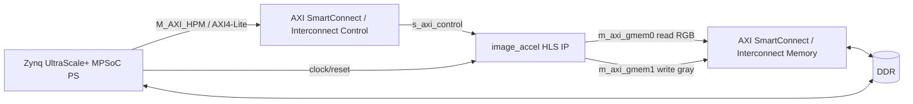

# Integracion Vivado del IP HLS `image_accel`

Este documento describe como integrar el acelerador HLS empaquetado como IP
Vivado para una plataforma basada en AMD Kria KV260 / K26.

El IP se genera con:

```bash
cd hls
tclsh scripts/run_hls.tcl
```

El paquete esperado queda en:

```text
hls/export/xilinx_com_hls_image_accel_1_0.zip
```

## Resumen del IP

| Campo | Valor |
|---|---|
| Nombre del IP | `image_accel` |
| VLNV | `xilinx.com:hls:image_accel:1.0` |
| Funcion top HLS | `image_accel` |
| Target | AMD Kria KV260 / K26 |
| Parte | `xck26-sfvc784-2LV-c` |
| Reloj objetivo | `250 MHz` |
| Entrada | RAW RGB888, `R, G, B` por pixel |
| Salida | RAW grayscale, un byte por pixel |
| Formula | `(77 * R + 150 * G + 29 * B) >> 8` |

## Diagrama de bloques esperado



## Interfaces del IP

| Puerto | Tipo | Conexion recomendada |
|---|---|---|
| `s_axi_control` | AXI4-Lite slave | AXI master del PS mediante SmartConnect |
| `m_axi_gmem0` | AXI4 master, lectura | DDR mediante SmartConnect |
| `m_axi_gmem1` | AXI4 master, escritura | DDR mediante SmartConnect |
| `ap_clk` | clock | reloj de sistema, idealmente `250 MHz` |
| `ap_rst_n` | reset activo bajo | Processor System Reset, salida activa baja |
| `interrupt` | interrupcion | opcional hacia IRQ del PS |

## Pasos en Vivado

1. Crear o abrir el proyecto Vivado para KV260/K26.
2. Agregar el repositorio de IP:

```text
hls/export/
```

3. Refrescar el IP Catalog.
4. Instanciar `image_accel`.
5. Instanciar o reutilizar el Zynq UltraScale+ MPSoC Processing System.
6. Habilitar un puerto AXI master del PS para controlar perifericos.
7. Habilitar acceso del PL hacia DDR para los puertos master del acelerador.
8. Conectar `s_axi_control` a un SmartConnect AXI4-Lite.
9. Conectar `m_axi_gmem0` y `m_axi_gmem1` a un SmartConnect AXI4 hacia DDR.
10. Conectar `ap_clk` al reloj de la plataforma.
11. Conectar `ap_rst_n` a un reset sincronizado activo bajo.
12. Validar el block design.
13. Generar el HDL wrapper.
14. Ejecutar synthesis, implementation y bitstream si se requiere ejecucion en hardware.
15. Exportar el hardware para crear una aplicacion embebida.

El repositorio incluye scripts para automatizar los pasos principales:

```bash
vivado -mode batch -source vivado/scripts/create_image_accel_bd.tcl
vivado -mode batch -source vivado/scripts/export_xsa.tcl
vivado -mode batch -source vivado/scripts/build_bitstream_xsa.tcl
```

El XSA sin bitstream, util para crear la aplicacion Vitis y revisar
`xparameters.h`, queda en:

```text
vivado/export/image_accel_kv260.xsa
```

El XSA con bitstream, util para ejecutar en hardware real, queda en:

```text
vivado/export/image_accel_kv260_bitstream.xsa
```

## Mapa de registros AXI4-Lite

El IP HLS genera un bus `s_axi_control` con offsets relativos a la base que
Vivado asigne al periferico.

| Offset | Registro | Acceso | Uso |
|---:|---|---|---|
| `0x00` | `CTRL` | RW | control del IP |
| `0x04` | `GIER` | RW | global interrupt enable |
| `0x08` | `IP_IER` | RW | interrupt enable |
| `0x0c` | `IP_ISR` | RW | interrupt status |
| `0x10` | `input_rgb_1` | W | direccion de entrada, bits `31:0` |
| `0x14` | `input_rgb_2` | W | direccion de entrada, bits `63:32` |
| `0x1c` | `output_gray_1` | W | direccion de salida, bits `31:0` |
| `0x20` | `output_gray_2` | W | direccion de salida, bits `63:32` |
| `0x28` | `num_pixels` | W | cantidad de pixeles |

Bits principales de `CTRL`:

| Bit | Nombre | Uso |
|---:|---|---|
| `0` | `AP_START` | escribir `1` para iniciar |
| `1` | `AP_DONE` | se activa al finalizar |
| `2` | `AP_IDLE` | indica estado idle |
| `3` | `AP_READY` | listo para nueva transaccion |
| `7` | `AUTO_RESTART` | reinicio automatico si se habilita |
| `9` | `INTERRUPT` | estado de interrupcion |

## Programacion desde software

Un ejemplo de driver C por registros esta en:

```text
sw/baremetal/
```

Para una imagen completa:

```text
num_pixels = 1920 * 1080 = 2073600
input_size = num_pixels * 3 = 6220800 bytes
output_size = num_pixels = 2073600 bytes
```

Secuencia minima:

1. Reservar dos regiones fisicas en DDR:

```text
input_rgb:   6,220,800 bytes
output_gray: 2,073,600 bytes
```

2. Copiar la imagen RAW RGB al buffer `input_rgb`.
3. Si el sistema usa cache, limpiar/flush del rango `input_rgb`.
4. Escribir registros del acelerador:

```c
write32(ACCEL_BASE + 0x10, (uint32_t)(input_rgb_addr));
write32(ACCEL_BASE + 0x14, (uint32_t)(input_rgb_addr >> 32));
write32(ACCEL_BASE + 0x1c, (uint32_t)(output_gray_addr));
write32(ACCEL_BASE + 0x20, (uint32_t)(output_gray_addr >> 32));
write32(ACCEL_BASE + 0x28, 2073600u);
write32(ACCEL_BASE + 0x00, 0x01u);
```

5. Esperar finalizacion por polling:

```c
while ((read32(ACCEL_BASE + 0x00) & 0x2u) == 0u) {
    ;
}
```

6. Si el sistema usa cache, invalidar el rango `output_gray`.
7. Leer o guardar el buffer grayscale.

## Relacion con el modelo SystemC/TLM

El modelo SystemC usa:

| Constante | Valor |
|---|---:|
| `INPUT_ADDR` | `0x00000000` |
| `OUTPUT_ADDR` | `0x00600000` |
| `NUM_PIXELS` | `2073600` |
| `RGB_SIZE` | `6220800` |
| `GRAY_SIZE` | `2073600` |

En hardware real, las direcciones pueden cambiar porque dependen del mapa de
DDR, del sistema operativo o del bare-metal linker script. Lo importante es que
el software escriba las direcciones fisicas reales en los registros HLS.

## Consideraciones

- `m_axi_gmem0` y `m_axi_gmem1` pueden conectarse al mismo SmartConnect hacia
  DDR si no hay dos caminos de memoria independientes.
- El IP usa direcciones de 64 bits en los registros `input_rgb` y
  `output_gray`.
- La salida no es RGB grayscale; es un byte grayscale por pixel.
- Si se usa Linux, el software debe obtener buffers fisicamente contiguos o
  usar un driver/mecanismo DMA compatible.
- Si se usa bare-metal, se debe cuidar coherencia de cache antes y despues de
  ejecutar el acelerador.

## Documentación relacionada

- [`README principal del proyecto HLS`](../README.md): requisitos, compilación,
  diagramas, mapa de memoria, resultados y organización de módulos.
- [`Guía bare-metal`](../sw/baremetal/README.md): driver AXI4-Lite y aplicación
  standalone.
- [`Estado del proyecto`](project_status.md): entregables y evidencia del flujo
  HLS, Vivado y Vitis.
